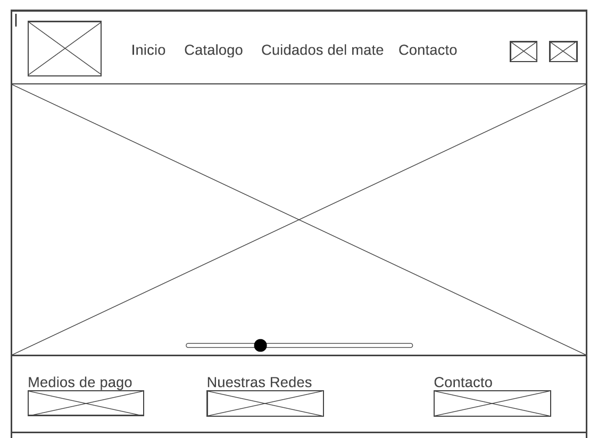

## TIENDA DE MATES Y ACCESORIOS.

## Integrantes:
Azcarate Abril -
Salvalaggio Niz Octavio Oscar -
Zerda Florencia Ayelén

## Tematica
Este proyecto fue creado para los amantes del mate, ofreciendo diferentes productos para llevar a cabo una linda tradición argentina.

## Animaciones/transiciones
Se agregó animación en el título de la página de "Cuidados del mate" y en el titulo del formulario en la página "Contacto".
Se incorporó una transición en las imágenes del Inicio.

Para estas animaciones se usó animate.css

## Páginas de referencia
https://www.mateandoarg.com/
https://www.tomamatetienda.com.ar/
Elegimos éstas páginas porque nos gustó la estética e intentamos hacer algo parecido.

https://www.mercadolibre.com.ar/
Elegimos Mercadolibre para tener una idea de precios de los productos.

## Paleta de colores: Distintos tonos de Verde
243E36
F1F7ED
7CA982

## API consumida
Es un conversor de monedas
https://www.exchangerate-api.com/

Se ubica en el catalogo, al presionar el botón "comprar" en el producto "TERMO STANLEY CLÁSICO 1.4 LTS CON TAPÓN CEBADOR DE ACERO INOXIDABLE".

## Github repo

Este es el repositorio [link](https://github.com/FZerda/grupo_16_TPO-TiendaWeb.git) 

## Sitio Web

El demo esta en el siguiente link [link](https://tiendadematesyaccesorios.netlify.app)

## Tech Stack

**Client:** HTML, CSS, JavaSCript

## Logo que creamos para la página:
 

## Bocetos hechos en Wireframe

